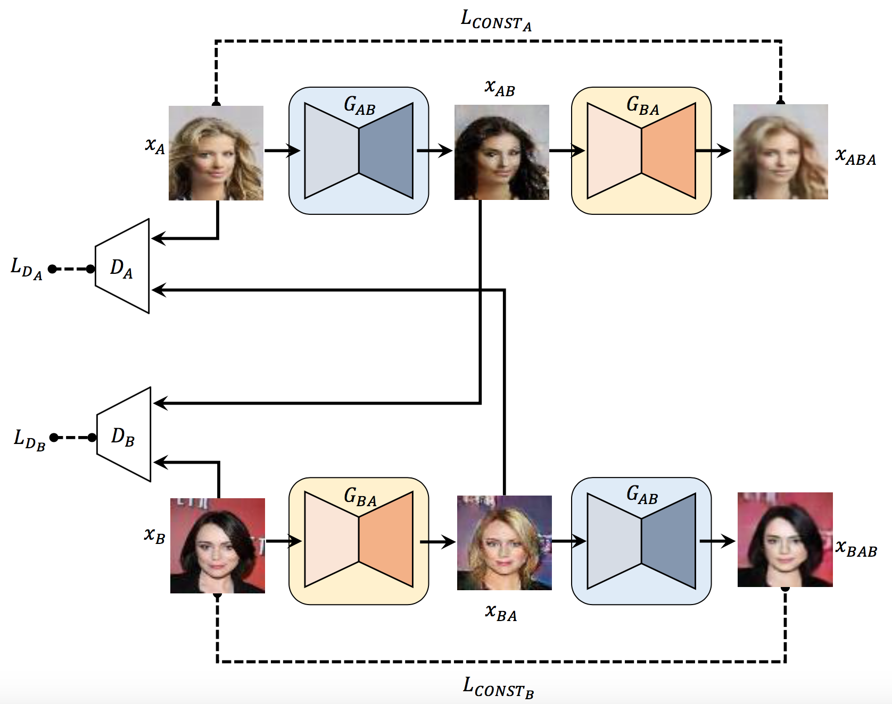
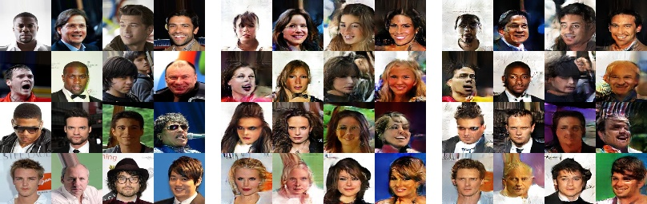
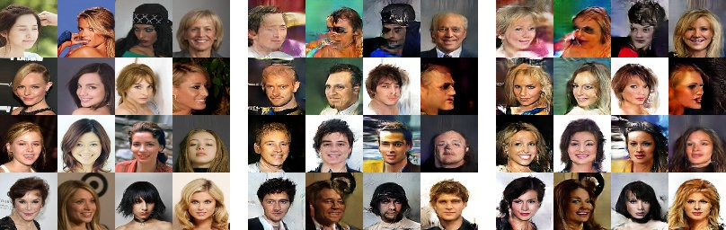

# Discover Cross-Domain Relations with GAN (DiscoGAN) with TensorFlow & slim
##  implementation based on http://arxiv.org/abs/1703.05192

  "Learning to Discover Cross-Domain Relations
    with Generative Adversarial Networks"
  Taeksoo Kim, Moonsu Cha, Hyunsoo Kim, Jung Kwon Lee, and Jiwon Kim

## Network architecture



## Requirements
* TensorFlow 1.0.0 or greater
* opencv (for `image_translate.py`)
* numpy
* pandas

## Training
### dataset download (celebA dataset)
* [celebA](https://www.dropbox.com/s/1s754dts6wvwe8r/img_align_celeba.zip?dl=1)
* [list_attr_celeba.txt](https://www.dropbox.com/s/3ahr57qurzdwv3v/list_attr_celeba.txt?dl=1)

### make datasets folder and unzip
```shell
$ mkdir datasets/celebA
$ mv ${YOUR_DOWNLOAD_DIR}/img_align_celeba.zip datasets/celebA
$ mv ${YOUR_DOWNLOAD_DIR}/list_attr_celeba.txt datasets/celebA
$ cd datasets/celebA
$ unzip img_align_celeba.zip
```

### editing train.sh
* Set the "TRAIN_DIR" (where to save checkpoint) to path you want
* Set the hyper-parameters

#### train.sh
```shell
# Where the training (fine-tuned) checkpoint and logs will be saved to.
TRAIN_DIR=$HOME/projects/discoGAN.tensorflow.slim/exp1

CUDA_VISIBLE_DEVICES=0 \
python train.py \
    --train_dir=${TRAIN_DIR} \
    --batch_size=128 \
    --initial_learning_rate=0.0002 \
    --max_steps=160000 \
    --save_steps=4000 \
    --adam_beta1=0.5 \
    --style_A='Male' \
    #--style_A='Blond_Hair' \
    #--style_B='Black_Hair' \
    #--constraint='Male' \
    #--constraint_type='1' \
```

### run ./train.sh
```shell
$ ./dcgan_train.sh
```
* You can use tensorboard for monitoring loss and generated images
```shell
$ tensorboard --logdir=exp1
```

## Image translate
### image_translate.sh
```shell
# Where the training (fine-tuned) checkpoint and logs will be saved to.
TRAIN_DIR=$HOME/projects/discoGAN.tensorflow.slim/exp1

batch=$1

CUDA_VISIBLE_DEVICES=0 \
python image_translate.py \
    --checkpoint_path=${TRAIN_DIR} \
    --checkpoint_step=-1 \
    --batch_size=$batch \
    --style_A='Male' \
    #--style_A='Blond_Hair' \
    #--style_B='Black_Hair' \
    #--constraint='Male' \
    #--constraint_type='1' \
```

### run ./image_translate.py
```shell
$ ./image_translate.sh batch_size (the number of images you want)
```

## Results
### celebA datasets
#### step 24000 (still training)
Male -> Female -> Male

    
Female -> Male -> Female



## Reference codes
#### SK T-Brain official code (pytorch)
* <https://github.com/SKTBrain/DiscoGAN>
#### carpedm20 code (pytorch)
* <https://github.com/carpedm20/DiscoGAN-pytorch>

## Author
  Il Gu Yi
